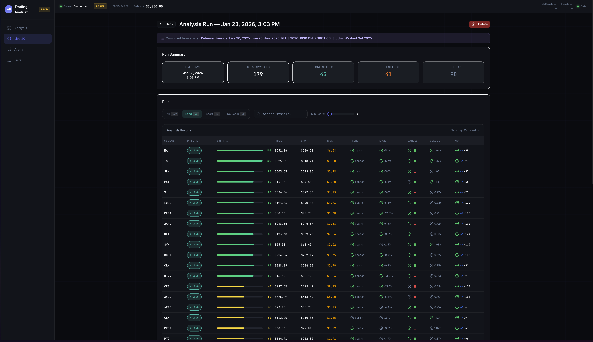

# Trading Analyst



> **🤖 AI-First Codebase**: This repository is designed for AI agents, not humans. The recommended way to interact with this codebase is through [Claude Code](https://claude.com/claude-code). Just describe what you want to do in natural language.

A local-first, human-in-the-loop semi-automated trading system for small teams.

## Overview

Trading Analyst combines human pattern recognition with systematic validation and disciplined execution. The system is designed around the principle that humans excel at identifying potential trading opportunities, while computers excel at validating setups quantitatively and executing trades with perfect discipline.

## Features

- **Real-time Charts** - Interactive stock price visualization using Lightweight Charts
- **Live 20 Evaluator** - Automated setup validation with deterministic scoring
- **Arena Simulations** - Test strategies with paper trading simulation
- **Broker Integration** - Execute trades through Interactive Brokers

## Prerequisites

- **Docker & Docker Compose** - For running backend services
- **Node.js 18+** - For frontend development
- **Interactive Brokers TWS/Gateway** - For live trading (optional, mock mode available)

## Development with Claude Code

This codebase was created entirely using [Claude Code](https://claude.com/claude-code), Anthropic's AI coding assistant, following a structured development workflow:

```
┌──────────┐    ┌──────────┐    ┌──────────┐    ┌───────────┐    ┌──────────┐
│  Ticket  │───►│ Research │───►│   Plan   │───►│ Implement │───►│  Review  │
└──────────┘    └──────────┘    └──────────┘    └───────────┘    └──────────┘
     │               │               │                │                │
  Manual      codebase-locator  frontend-eng    backend-eng      Gemini CLI
              codebase-analyzer backend-eng     frontend-eng     Claude Code
              pattern-finder   Gemini CLI      code-cleanup
```

### Workflow Stages

| Stage | Command | Agents Used | Output |
|-------|---------|-------------|--------|
| **Ticket** | Manual | — | `thoughts/shared/tickets/*.md` |
| **Research** | `/research_codebase` | codebase-locator, codebase-analyzer, codebase-pattern-finder | `thoughts/shared/research/*.md` |
| **Plan** | `/create_plan` | frontend-engineer, backend-engineer (consultation), Gemini CLI (review) | `thoughts/shared/plans/*.md` |
| **Implement** | `/implement_plan` | backend-engineer, frontend-engineer, code-cleanup, code-simplifier | Working code + tests |
| **Review** | `/describe_pr`, `/gemini_review` | Gemini CLI, Claude Code | PR merged |

### Key Agents

- **codebase-locator** — Finds files and components relevant to a task
- **codebase-analyzer** — Analyzes implementation details
- **backend-engineer** — Implements Python/FastAPI code, APIs, database models
- **frontend-engineer** — Implements React/TypeScript components, UI logic
- **code-cleanup** — Ensures code quality and consistency
- **Gemini CLI** — Provides independent AI review of plans and PRs for additional quality assurance

The complete workflow configuration is available in the `.claude/` directory.

### Setup

```bash
./scripts/setup-claude-code.sh
```

This installs LSP plugins (pyright, typescript) for code intelligence and skills (frontend-design, code-simplifier) for development.

## Quick Start

```bash
# Clone the repository
git clone https://github.com/YOUR-USERNAME/trading-analyst.git
cd trading-analyst
```

### Using Claude Code (Recommended)

Just tell Claude Code what you need:
- "Start the dev environment"
- "Launch the production version"

### Manual Setup

**Development Environment:**
```bash
# Start backend services (auto-generates .env.dev with unique ports)
./scripts/dc.sh up -d

# In another terminal, start frontend
cd frontend && npm install && npm run dev
```

**Production Environment:**
```bash
# Start production services
./scripts/prod.sh -d

# In another terminal, start frontend (fixed port 5177)
cd frontend && VITE_API_PROXY_TARGET=http://localhost:8093 npm run dev -- --port 5177
```

On first run, `./scripts/dc.sh` automatically:
1. Generates `.env.dev` with unique project name and ports (based on directory name)
2. Creates isolated analytics directory
3. Starts PostgreSQL and backend containers

Check your generated `.env.dev` file for the exact port numbers.

**Default URLs:**

| Environment | Frontend | Backend API | API Docs |
|-------------|----------|-------------|----------|
| Development | `http://localhost:52XX` | `http://localhost:81XX` | `http://localhost:81XX/docs` |
| Production | `http://localhost:5177` | `http://localhost:8093` | `http://localhost:8093/docs` |

*Development ports vary based on directory name - check `.env.dev` for exact values.*

## Configuration

The system uses environment variables for configuration. Key settings:

| Variable | Description | Default |
|----------|-------------|---------|
| `BROKER_TYPE` | Broker to use (`mock` or `ib`) | `mock` |
| `IB_HOST` | Interactive Brokers Gateway host | `host.docker.internal` |
| `IB_PORT` | Interactive Brokers Gateway port | `4002` |
| `MARKET_DATA_PROVIDER` | Data source (`yahoo`, `ib`, `mock`) | `yahoo` |

See [.env.dev.example](.env.dev.example) for all configuration options.

## Architecture

```
┌─────────────────┐    ┌─────────────────┐    ┌─────────────────┐
│    Frontend     │    │    Backend      │    │   Database      │
│                 │    │                 │    │                 │
│ React           │◄──►│ FastAPI         │◄──►│ PostgreSQL      │
│ TypeScript      │    │ Service Layer   │    │                 │
│ shadcn/ui       │    │ Broker API      │    │                 │
└─────────────────┘    └─────────────────┘    └─────────────────┘
```

**Technology Stack:**
- **Backend**: FastAPI, PostgreSQL, Alembic, SQLAlchemy
- **Frontend**: React, TypeScript, shadcn/ui, Lightweight Charts
- **Data**: Yahoo Finance (default), Interactive Brokers
- **Infrastructure**: Docker Compose

## Documentation

- **[Documentation Hub](docs/README.md)** - Main documentation index
- **[Development Guide](docs/guides/development.md)** - Local development setup
- **[Testing Guide](docs/guides/testing.md)** - Testing standards and commands

## License

MIT License - see [LICENSE](LICENSE) for details.

## Disclaimer

**This software is provided as-is for educational and personal use.**

- This system can execute real trades with real money
- Past performance does not guarantee future results
- Always start with `BROKER_TYPE=mock` until you understand the system
- The authors are not responsible for any financial losses
- Consult a financial advisor before making investment decisions
